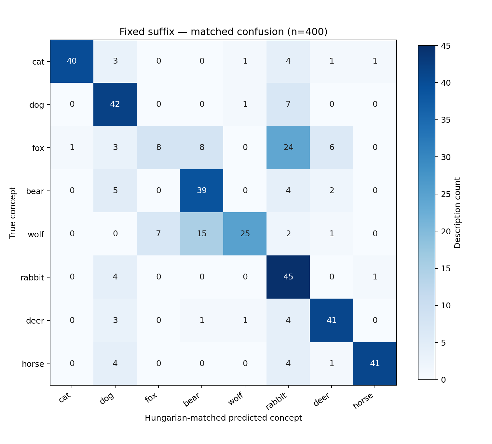
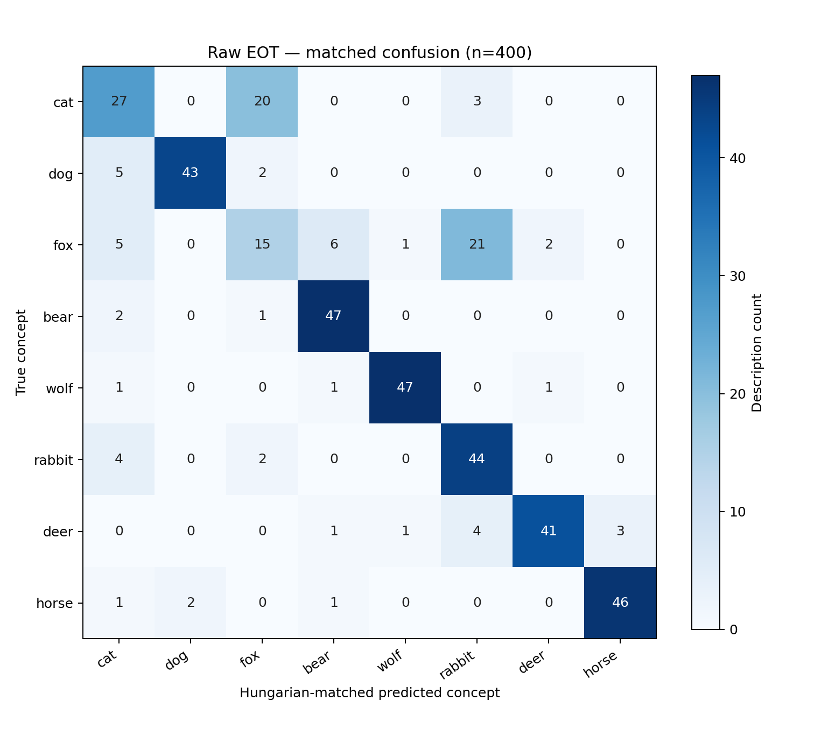

# Balanced Paired Concept-Description Clustering

## 1. Research Question

Do name-free descriptions of cat, dog, fox, bear, wolf, rabbit, deer, horse form concept-dependent clusters after semantic facet, sentence length, generation slot, generation round, and generation instructions are controlled?

## 2. Manipulated and Controlled Variables

The manipulated variable is the animal concept being described. Controlled variables are the number of descriptions per concept, semantic-facet distribution, effective SD 1.4 CLIP token-length distribution, generation slot, generation round, generation source and model, candidate-generation instructions, concept-name exclusion rules, SD 1.4 generation-validation protocol, embedding model, and spherical k-means hyperparameters.

Measured outcomes are Adjusted Rand Index, Normalized Mutual Information, Hungarian-matched clustering accuracy, cosine silhouette score, per-class recall, and matched confusion matrices. True concept labels were unavailable to embedding preprocessing and clustering and were introduced only for post-hoc evaluation.

## 3. Balanced Paired Dataset Design

The dataset contains 8 concepts and 50 shared slots. Each of ten facets has five slots with the same short, short, medium, long, long schedule. Every slot fixes a common semantic instruction and generation round; one accepted description is retained for every `(concept, slot)` pair. Stored descriptions remain unsuffixed.

Short prompts contain 14–19 effective tokens, medium prompts 21–26, and long prompts 28–33, measured by the actual SD 1.4 tokenizer. The deterministic candidate source is `balanced_paired_repository_generator` using `deterministic_concept_profiles_v1` under the same generation policy for every concept. Replenishment changes only a missing concept-slot entry and is recorded separately from the controlled slot round.

## 4. Validation and Balance Checks

Intended balance constraints: **passed** (400/400 rows). The machine-readable checks and vocabulary audit are in `dataset_validation.json`; compact concept-level counts are in `dataset_balance.csv`. No accepted prompt contains a configured concept name or lexical variant, falls outside its assigned token range, or is truncated.

SD 1.4 generation validation reused the repository's original three-seed, two-stage generation settings and independent CLIP ensemble thresholds. The same seed list and image-generation settings were used for every concept in a shared slot.

## 5. Fixed-Suffix Results

The fixed suffix is exactly ` This sentence describes the concept`. It is appended only during extraction, and the final non-special token must decode to `concept`. Its contextual final-layer hidden state is extracted and row-L2-normalized.

Per-class recall: cat=0.800, dog=0.840, fox=0.160, bear=0.780, wolf=0.500, rabbit=0.900, deer=0.820, horse=0.820.

## 6. Unsuffixed EOT Results

The original description is tokenized without any prefix or suffix. The readout index is `attention_mask.sum(dim=1) - 1`, selecting the actual EOT token from the final SD 1.4 CLIP hidden state. Each vector is row-L2-normalized; no global centering is applied.

Per-class recall: cat=0.540, dog=0.860, fox=0.300, bear=0.940, wolf=0.940, rabbit=0.880, deer=0.820, horse=0.920.

## 7. Comparison

| Representation | ARI | NMI | Matched Accuracy | Cosine Silhouette |
|---|---:|---:|---:|---:|
| Fixed suffix | 0.4697 | 0.5800 | 0.7025 | 0.0860 |
| Raw EOT | 0.6338 | 0.7047 | 0.7750 | 0.0863 |

Post-hoc cluster alignment with controlled writing variables:

| Representation | Concept NMI | Facet NMI | Length-bin NMI | Round NMI |
|---|---:|---:|---:|---:|
| Fixed suffix | 0.5800 | 0.0315 | 0.0382 | 0.0349 |
| Raw EOT | 0.7047 | 0.0238 | 0.0584 | 0.0548 |

Historical comparison:

| Experiment | Representation | ARI | Matched Accuracy | Notes |
|---|---|---:|---:|---|
| Template-heavy dataset | fixed suffix | 0.9934 | 0.9970 | repeated templates |
| Diverse unbalanced 4x50 | fixed suffix | 0.4552 | 0.6300 | freer descriptions but unbalanced facets |
| Diverse unbalanced 4x50 | Raw EOT | 0.5105 | 0.7100 | unsuffixed EOT |
| New balanced paired 8x50 | Fixed suffix | 0.4697 | 0.7025 | paired balanced controls |
| New balanced paired 8x50 | Raw EOT | 0.6338 | 0.7750 | paired balanced controls |

Historical result files found: 3. Missing: 0. Exact paths are listed in `historical_paths.csv`.

## 8. Interpretation

- Fox↔bear confusion totals 8 descriptions for the fixed suffix and 7 for raw EOT.
- For Fixed suffix, concept NMI (0.5800) exceeds the largest controlled-variable NMI (0.0382).
- For Raw EOT, concept NMI (0.7047) exceeds the largest controlled-variable NMI (0.0584).
- The two representations' cluster assignments have NMI 0.5028; the confusion matrices provide the class-level comparison.

Numerical differences should be read conservatively. PCA figures are qualitative only; all clustering and reported metrics use the original 768-dimensional embeddings.

## 9. Limitations

The SD validation classifier is a closed-set CLIP ensemble rather than human ground truth. Candidate prose comes from one controlled deterministic source, so the experiment controls source variation but does not establish cross-author generality. Hungarian matching uses labels only after clustering. Spherical k-means imposes a fixed number of approximately spherical clusters and does not prove that the representation naturally contains exactly that many modes.
