# Revised Original-W0 Geometry of Balanced Animal Descriptions

## 1. Research Questions

This revision tests whether unchanged original SD 1.4 cross-attention projections preserve description clustering under spherical and ordinary Euclidean objectives, and reports explicit concept-name proximity for all eight animals in text space and all 16 selected `W0` spaces. The analysis uses the same final balanced 8×50 dataset and does not generate images, load an edited checkpoint, or modify model weights.

## 2. Dataset and Representations

The dataset contains exactly 400 name-free descriptions: 50 each for cat, dog, fox, bear, wolf, rabbit, deer, and horse. The dataset and cached-embedding audits pass, and the ordered original `attn2.to_v` inventory contains 5×(320×768), 5×(640×768), 6×(1280×768) matrices.

Unsuffixed EOT is the final hidden state at `attention_mask.sum(dim=1) - 1` with no added text. Fixed suffix appends exactly ` This sentence describes the concept` and reads the contextual hidden state of the final content token `concept`. The OCE-faithful bare-name representation reads the final content token immediately before EOT at `attention_mask.sum() - 2`; the matched name controls retain bare-name EOT and fixed-suffix `concept` readouts.

## 3. Why Spherical and Euclidean K-Means Are Both Tested

Spherical k-means emphasizes vector direction: it receives row-normalized inputs, assigns by cosine similarity, and normalizes updated centroids. Raw Euclidean k-means is not assumed to be worse; it receives unnormalized vectors and therefore uses both direction and magnitude. Normalized Euclidean k-means starts from the same unit vectors as spherical k-means but uses ordinary arithmetic centroid updates without manually renormalizing centroids, isolating that algorithmic difference.

Across the 17 spaces, raw Euclidean ARI exceeds spherical ARI in 9/17 EOT cases and 7/17 fixed-suffix cases. Normalized Euclidean exceeds spherical in 8/17 and 10/17 cases, respectively. Ordinary Euclidean k-means therefore does not necessarily perform worse.

## 4. Normalization Protocol

For every text vector `h`, the normalized control is `h / ||h||₂`. For every layer, raw output is `W0_l h`, followed by row normalization for spherical clustering and all cosine prototype comparisons. Raw description norms range from 8.501 to 47.825 across concepts, representations, and spaces; full description/name summaries are in `vector_norm_summary.csv`.

Raw and normalized vectors are saved separately. Spherical inputs and centers are unit-normalized. Euclidean-raw inputs are not normalized. Euclidean-normalized inputs are unit-normalized, but their fitted centroids are not manually renormalized.

The mean absolute ARI difference between raw and normalized Euclidean k-means is 0.0390 for EOT and 0.0602 for fixed suffix across Text and all selected layers. This confirms that retaining vector magnitude changes results, but it does not by itself identify magnitude as the causal source of any individual-layer change.

## 5. Description Clustering Across Text Space and W0 Layers

| Representation | Method | Text ARI | Best W0 ARI | Worst W0 ARI |
|---|---|---|---|---|
| Unsuffixed EOT | Spherical normalized | 0.6338 | L8 (0.6795) | L12 (0.0875) |
| Unsuffixed EOT | Euclidean raw | 0.5154 | L7 (0.6790) | L13 (0.0725) |
| Unsuffixed EOT | Euclidean normalized | 0.5684 | L5 (0.6631) | L13 (0.0754) |
| Fixed suffix | Spherical normalized | 0.4697 | L9 (0.6049) | L12 (0.0487) |
| Fixed suffix | Euclidean raw | 0.4450 | L10 (0.6096) | L12 (0.0577) |
| Fixed suffix | Euclidean normalized | 0.6094 | L15 (0.6145) | L12 (0.0578) |

In method order spherical, raw Euclidean, and normalized Euclidean, the post-hoc best W0 layer indices are eot: [8, 7, 5]; fixed_suffix: [9, 10, 15], while the worst indices are eot: [12, 13, 13]; fixed_suffix: [12, 12, 12]. Thus the best layer is not stable across methods. The worst layer is more stable for fixed suffix, but EOT shifts from L12 under spherical to L13 under both Euclidean controls. EOT has higher ARI than fixed suffix in 12/17 spherical spaces, 14/17 raw-Euclidean spaces, and 13/17 normalized-Euclidean spaces. EOT therefore usually, but not universally, outperforms fixed suffix.

The next four figures show all spaces and all three clustering methods. Their silhouettes use cosine only for spherical normalized and Euclidean distance for both ordinary k-means controls.

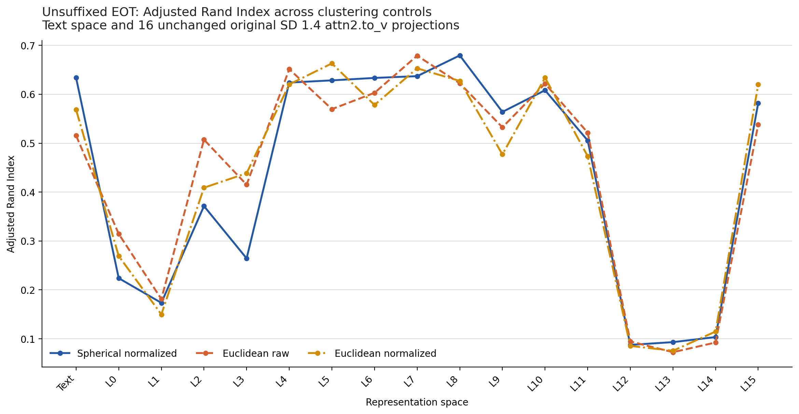

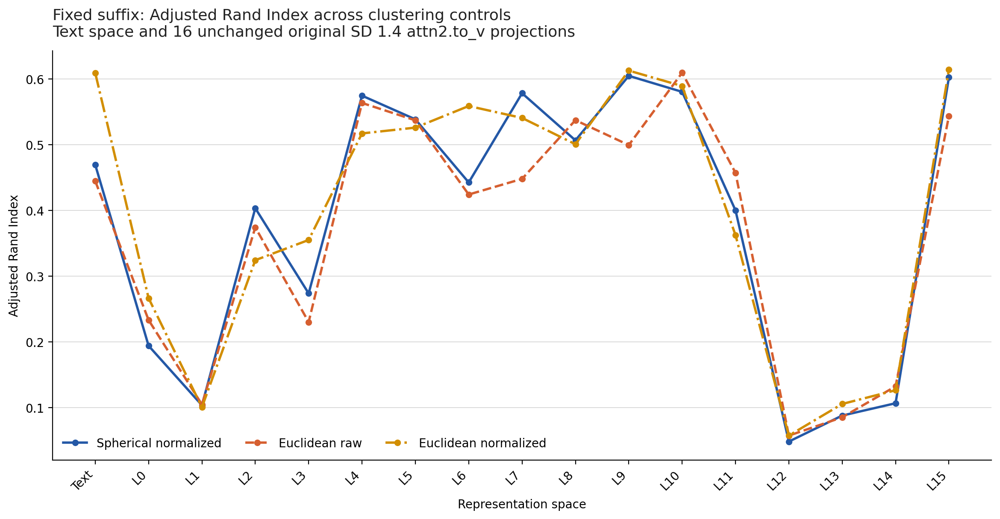

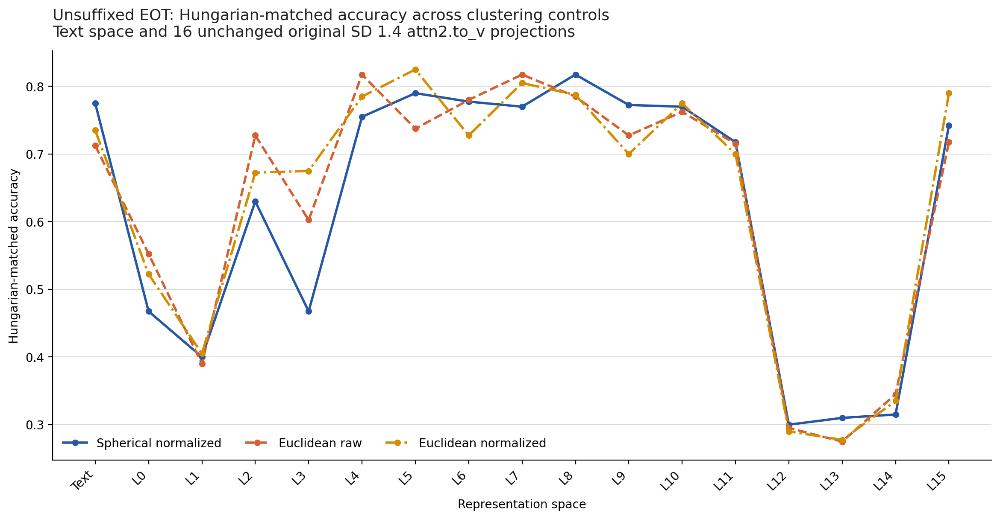

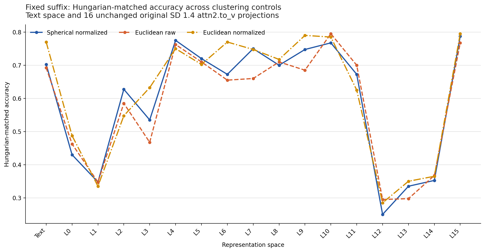

## 6. Per-Animal Name-to-Description Distances in Text Space

All prototype values below use cosine distance after normalizing every description and prototype, averaging the 50 normalized descriptions for a concept, and normalizing that mean. Positive margin means the name is closer to its own centroid than to every other animal centroid.

### Matched EOT

| Animal | Own distance | Nearest other | Other distance | Margin | Own rank |
|---|---|---|---|---|---|
| cat | 0.5544 | dog | 0.6550 | +0.1005 | 1 |
| dog | 0.5234 | wolf | 0.6654 | +0.1420 | 1 |
| fox | 0.7172 | wolf | 0.6866 | -0.0305 | 2 |
| bear | 0.6856 | dog | 0.7397 | +0.0540 | 1 |
| wolf | 0.6637 | bear | 0.7677 | +0.1040 | 1 |
| rabbit | 0.7039 | cat | 0.7462 | +0.0422 | 1 |
| deer | 0.5388 | horse | 0.6862 | +0.1474 | 1 |
| horse | 0.5564 | dog | 0.7281 | +0.1716 | 1 |

### Matched fixed suffix

| Animal | Own distance | Nearest other | Other distance | Margin | Own rank |
|---|---|---|---|---|---|
| cat | 0.1967 | dog | 0.2125 | +0.0158 | 1 |
| dog | 0.1693 | horse | 0.1993 | +0.0299 | 1 |
| fox | 0.2004 | dog | 0.2002 | -0.0002 | 2 |
| bear | 0.1918 | dog | 0.1820 | -0.0098 | 2 |
| wolf | 0.1873 | dog | 0.2138 | +0.0265 | 1 |
| rabbit | 0.1990 | dog | 0.2092 | +0.0102 | 1 |
| deer | 0.1655 | fox | 0.1828 | +0.0173 | 1 |
| horse | 0.1680 | dog | 0.2085 | +0.0405 | 1 |

### OCE-last-token -> EOT descriptions

| Animal | Own distance | Nearest other | Other distance | Margin | Own rank |
|---|---|---|---|---|---|
| cat | 0.7930 | dog | 0.9427 | +0.1497 | 1 |
| dog | 0.7477 | horse | 0.8892 | +0.1414 | 1 |
| fox | 0.9453 | cat | 0.9347 | -0.0106 | 2 |
| bear | 0.8637 | deer | 0.8994 | +0.0357 | 1 |
| wolf | 0.7894 | cat | 0.8936 | +0.1041 | 1 |
| rabbit | 0.8830 | cat | 0.9375 | +0.0545 | 1 |
| deer | 0.7749 | bear | 0.9360 | +0.1612 | 1 |
| horse | 0.7937 | deer | 0.9567 | +0.1630 | 1 |

The third table is intentionally cross-readout. Its absolute distances are not pooled with either matched condition.

## 7. Per-Animal Distances Across All W0 Layers

Each heatmap retains all eight animals and Text plus every selected W0 layer. Margin heatmaps use a diverging scale centered at zero; rank heatmaps show the own-centroid position among eight centroids. In the full analysis, no single illustrative layer, including L8, replaces the all-layer results.

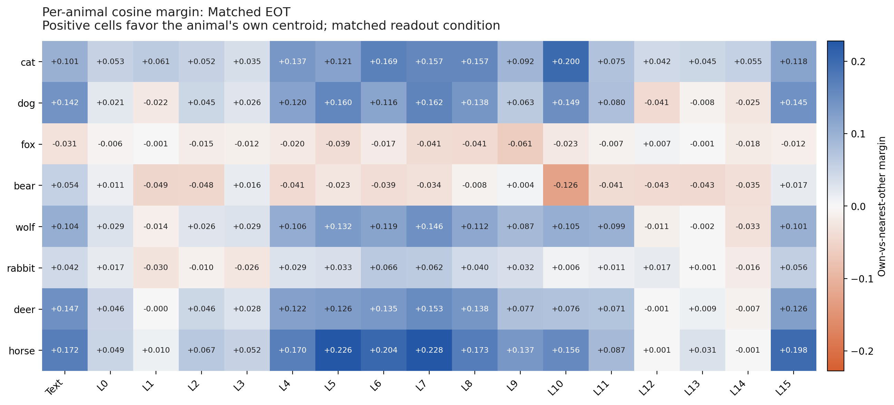

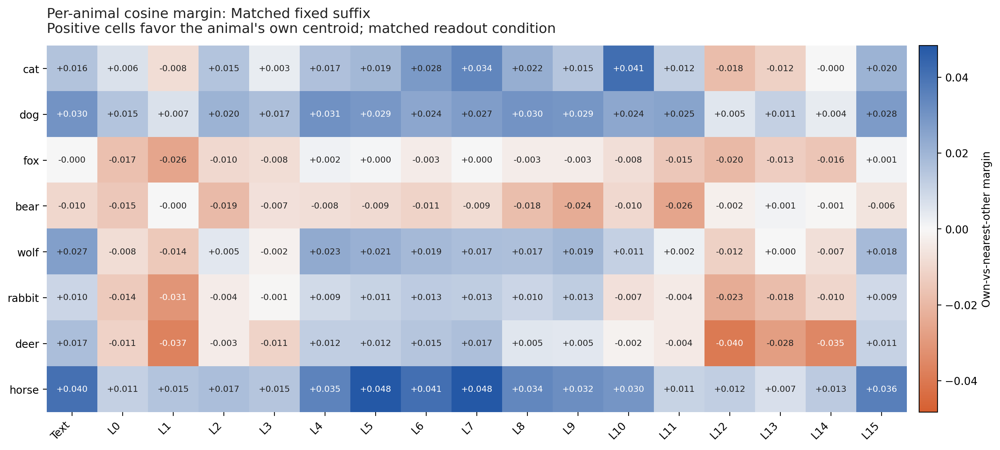

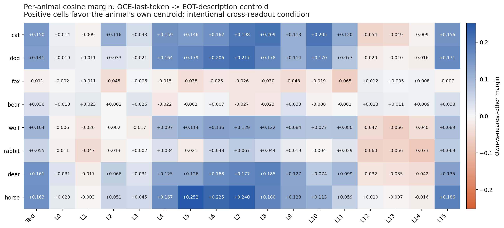

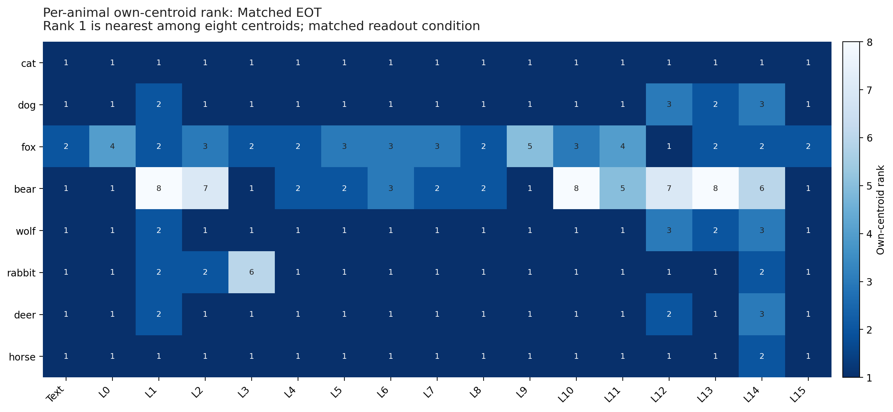

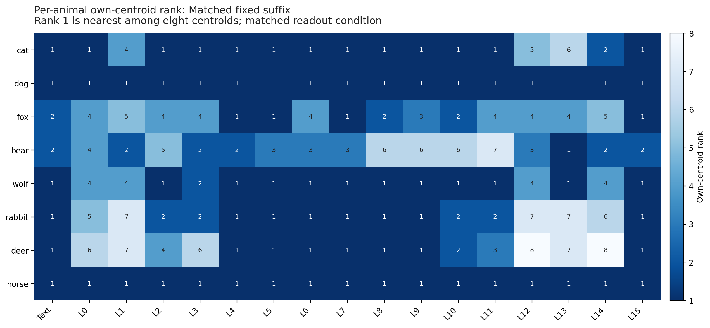

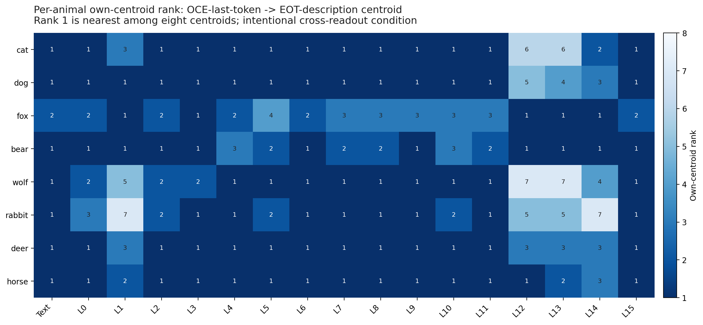

The compact all-space summary below gives `rank-1 count / 8; mean margin`. Mean margin is only a summary: a positive mean does not imply that every animal succeeded, so the individual rows in `prototype_distance_by_animal.csv` remain primary.

| Space | Matched EOT | Matched fixed | OCE-last -> EOT |
|---|---|---|---|
| Text | 7/8; +0.091 | 6/8; +0.016 | 7/8; +0.100 |
| L0 | 7/8; +0.027 | 3/8; -0.004 | 5/8; +0.010 |
| L1 | 2/8; -0.006 | 2/8; -0.012 | 3/8; -0.007 |
| L2 | 5/8; +0.021 | 4/8; +0.003 | 5/8; +0.026 |
| L3 | 6/8; +0.018 | 3/8; +0.001 | 7/8; +0.020 |
| L4 | 6/8; +0.078 | 7/8; +0.015 | 6/8; +0.089 |
| L5 | 6/8; +0.092 | 7/8; +0.016 | 5/8; +0.095 |
| L6 | 6/8; +0.094 | 6/8; +0.016 | 7/8; +0.116 |
| L7 | 6/8; +0.104 | 7/8; +0.018 | 6/8; +0.122 |
| L8 | 6/8; +0.089 | 6/8; +0.012 | 6/8; +0.108 |
| L9 | 7/8; +0.054 | 6/8; +0.011 | 7/8; +0.072 |
| L10 | 6/8; +0.068 | 4/8; +0.010 | 5/8; +0.076 |
| L11 | 6/8; +0.047 | 4/8; +0.000 | 6/8; +0.050 |
| L12 | 4/8; -0.004 | 2/8; -0.012 | 3/8; -0.022 |
| L13 | 4/8; +0.004 | 4/8; -0.006 | 2/8; -0.026 |
| L14 | 1/8; -0.010 | 2/8; -0.007 | 2/8; -0.022 |
| L15 | 7/8; +0.093 | 7/8; +0.015 | 7/8; +0.105 |

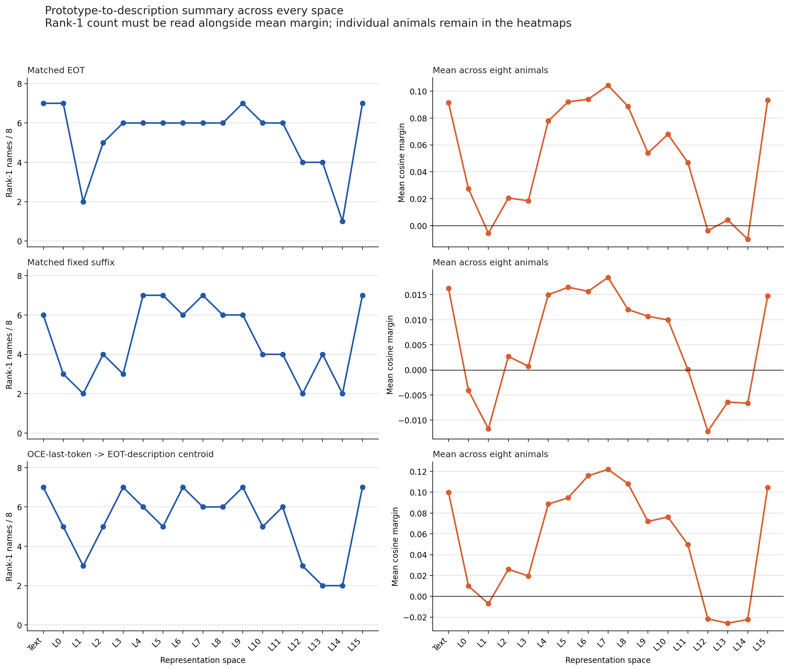

## 8. Readout Comparison

The difference heatmap subtracts matched-EOT margin from OCE-last-token-to-EOT margin for every animal and space. It isolates where changing the name readout changes own-versus-other separation while preserving the cross-readout label.

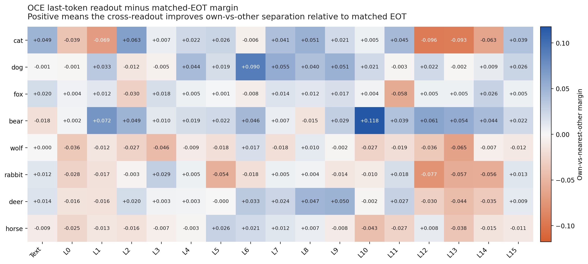

Text-space `c` and layer-wise `W0c` are both tested, but `c` is never directly compared with `W0c`: different W0 layers can have different output dimensions and coordinate systems.

## 9. Main Findings

- Ordinary Euclidean k-means is a genuine robustness control and is not uniformly worse than spherical k-means; the exact win counts are reported above.
- Raw Euclidean differs from both normalized methods because the pre-normalization norms vary and remain part of its distance objective. The norm audit should be consulted before attributing raw-Euclidean changes only to direction.
- The best W0 layer changes across all three clustering methods for both representations. The fixed-suffix worst layer stays at L12, whereas the EOT worst layer is L12 for spherical and L13 for both Euclidean controls.
- EOT outperforms fixed suffix in most, but not all, spaces: 12/17, 14/17, and 13/17 for spherical, raw Euclidean, and normalized Euclidean, respectively. This conclusion is not inferred from L8 alone.
- Name-to-description conclusions are animal-, layer-, and readout-specific. Rank-1 count and mean margin summarize the eight rows but never replace them.

## 10. Limitations

This is a descriptive geometry analysis, not a test of whether OCE can erase a concept distribution. Prototype centroids use true labels only after clustering and do not establish semantic identity or causal representation. Best/worst layer labels are post-hoc. Raw Euclidean can be sensitive to magnitude for reasons unrelated to concept identity. Cross-readout OCE-last-token distances intentionally mix name and description readout rules and cannot be interpreted alone as pure semantic distance.
