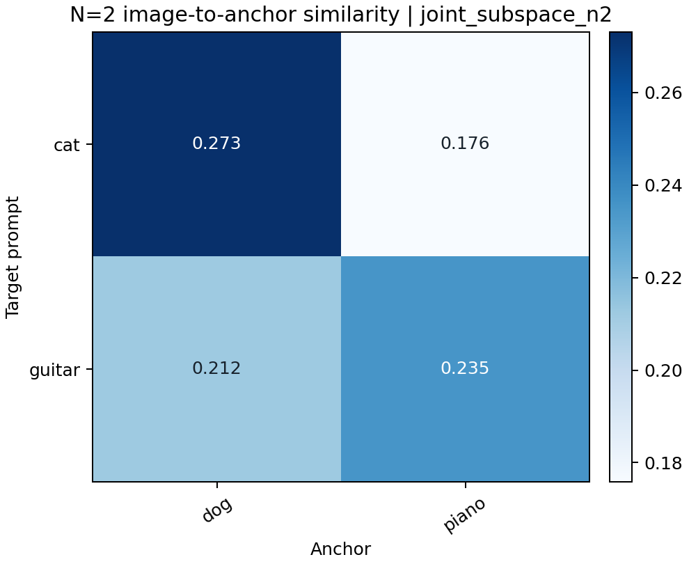
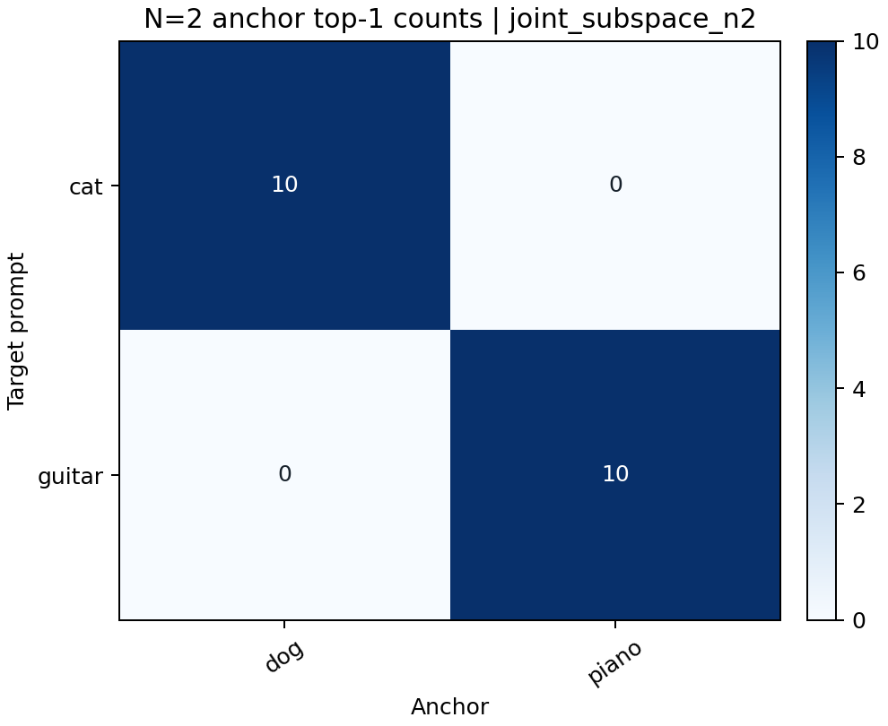
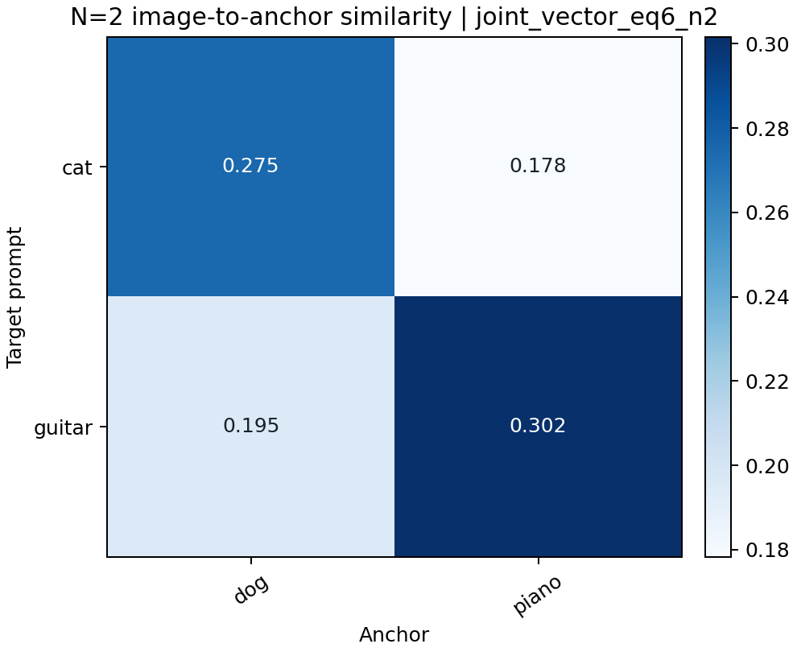

# Official OCE Subspace Correspondence Diagnostic

This report records observations rather than presuming H1–H4. The official
baseline is the repository's unchanged **subspace objective**. The vector-wise
paired objective is labeled **Eq. 6 ablation** throughout.

## Observed answers at the current stop gate

- All ten configured words are visually recognizable in Original SD across
  the ten fixed seeds. `car` has the largest CLIP spread but no obvious visual
  feasibility failure.
- `cat → dog` is the only single-pair subspace mapping with clear, stable
  own-anchor images. The other four erase their targets but mostly generate
  unrelated content; `guitar → piano` is only the numeric second-best.
- N=2 joint subspace retains positive dog/piano CLIP margins, but the
  `guitar` grid does not show stable pianos. The CLIP candidate-set result
  therefore does not establish visual pairwise correspondence.
- The Eq. 6 ablation has a stronger feature diagonal and visibly produces
  pianos for most guitar seeds, while its guitar target similarity is higher
  than joint subspace (weaker erasure by that measure).
- Swapping the anchor assignment changes the official objective only at about
  float32 numerical precision, confirming that pair identity is not encoded
  in that objective. The resulting rotations/checkpoints are nevertheless
  not all numerically close, consistent with an unstable/non-unique
  Procrustes solution near this objective.
- Non-target preservation is not yet evaluated, so no preservation conclusion
  is made. N=5 should not be started at this gate: four single-pair mappings
  have obvious visual own-anchor failures and the control phase is pending.

## 1. Tokenizer check

Tokenization below uses the exact Stable Diffusion 1.4 CLIP tokenizer with
special BOS/EOS tokens excluded.

| Concept | Token ids | Token strings | Content-token count |
|---|---|---|---:|
| cat | `[2368]` | `["cat</w>"]` | 1 |
| airplane | `[16451]` | `["airplane</w>"]` | 1 |
| church | `[2735]` | `["church</w>"]` | 1 |
| truck | `[4629]` | `["truck</w>"]` | 1 |
| guitar | `[5084]` | `["guitar</w>"]` | 1 |
| dog | `[1929]` | `["dog</w>"]` | 1 |
| helicopter | `[11956]` | `["helicopter</w>"]` | 1 |
| castle | `[3540]` | `["castle</w>"]` | 1 |
| car | `[1615]` | `["car</w>"]` | 1 |
| piano | `[7894]` | `["piano</w>"]` | 1 |

Raw files: [CSV](metrics/tokenization.csv), [JSON](metrics/tokenization.json).

## 2. Original SD feasibility

Each concept uses `a photo of a {concept}`, seeds
`42–51`,
50 steps, guidance 7.5, and 512×512 images. CLIP values are raw cosine
similarities, not probabilities. Visual stability must be read together with
the saved grids.

| Concept | Mean alignment | SD | Minimum |
|---|---:|---:|---:|
| cat | 0.2821 | 0.0073 | 0.2705 |
| airplane | 0.2661 | 0.0105 | 0.2539 |
| church | 0.2903 | 0.0060 | 0.2770 |
| truck | 0.2705 | 0.0097 | 0.2555 |
| guitar | 0.3032 | 0.0082 | 0.2878 |
| dog | 0.2745 | 0.0093 | 0.2572 |
| helicopter | 0.2933 | 0.0093 | 0.2805 |
| castle | 0.2949 | 0.0077 | 0.2841 |
| car | 0.2525 | 0.0198 | 0.2334 |
| piano | 0.3001 | 0.0089 | 0.2857 |

Individual grids are under [grids/feasibility](grids/feasibility/).

## 3. Single-pair subspace screening

Every edited image is scored against all five anchors, not only its own
anchor. The directional label requires target similarity to decrease,
own-anchor similarity to increase, and the mechanical low-variance alarm to
remain within its configured bound; it does not automatically remove a pair.

| Mapping | Orig target | Edited target | Target Δ | Own anchor | Anchor Δ | Best other | Mean margin | Min margin | Positive | Own top-1 | Label |
|---|---:|---:|---:|---:|---:|---:|---:|---:|---:|---:|---|
| cat → dog | 0.2821 | 0.2065 | -0.0756 | 0.2719 | +0.0441 | 0.1922 | +0.0797 | +0.0421 | 100% | 100% | passes directional screen |
| airplane → helicopter | 0.2661 | 0.2197 | -0.0464 | 0.2263 | +0.0256 | 0.2228 | +0.0035 | -0.0366 | 60% | 60% | passes directional screen |
| church → castle | 0.2903 | 0.2057 | -0.0847 | 0.2127 | -0.0014 | 0.2041 | +0.0087 | -0.0114 | 60% | 60% | weaker / does not pass |
| truck → car | 0.2705 | 0.2127 | -0.0579 | 0.2151 | +0.0047 | 0.2330 | -0.0179 | -0.0498 | 10% | 10% | passes directional screen |
| guitar → piano | 0.3032 | 0.2179 | -0.0854 | 0.2339 | +0.0242 | 0.2234 | +0.0105 | -0.0495 | 80% | 80% | passes directional screen |

Seed-aligned grids are under [grids/single_pair](grids/single_pair/). Per-image
scores, including all five anchor columns, are in
[single_pair_per_image.csv](metrics/single_pair_per_image.csv).

Manual grid review: Target erasure is visually evident for all five mappings, but clear own-anchor generation is visually stable only for cat -> dog. The remaining four mappings mostly produce unrelated scenes or textures rather than their named anchors.

- **cat -> dog:** All ten edited seeds show recognizable dogs; no obvious cat-dog hybrids or global image collapse.
- **airplane -> helicopter:** Airplanes disappear, but the edited images mostly show cities, textures, distant ambiguous objects, or other unrelated scenes rather than recognizable helicopters.
- **church -> castle:** Churches disappear, but edited images are mostly generic residential or office buildings; recognizable castles are not stable.
- **truck -> car:** Trucks disappear, but edited images mostly become textures or unrelated objects; recognizable cars are not stable.
- **guitar -> piano:** Guitars disappear, but edited images mostly become architectural textures or unrelated scenes; recognizable pianos are not stable despite comparatively favorable five-anchor CLIP ranking.

### N=2 selection

Selected: **cat → dog, guitar → piano**.

Selection record and exact screening evidence:
[n2_selection.json](inputs/n2_selection.json). Basis:
`manual selection after numeric and grid review`.

## 4. N = 2 joint subspace

| Mapping | Target sim | Own anchor | Other anchor | Mean margin | Min margin | Positive | Own top-1 |
|---|---:|---:|---:|---:|---:|---:|---:|
| cat → dog | 0.2067 | 0.2731 | 0.1759 | +0.0972 | +0.0928 | 100% | 100% |
| guitar → piano | 0.2229 | 0.2351 | 0.2123 | +0.0228 | +0.0033 | 100% | 100% |

## 5. N = 2 joint vector-wise Eq. 6 ablation

This is an ablation and is not described as the official OCE baseline.

| Mapping | Target sim | Own anchor | Other anchor | Mean margin | Min margin | Positive | Own top-1 |
|---|---:|---:|---:|---:|---:|---:|---:|
| cat → dog | 0.2157 | 0.2750 | 0.1783 | +0.0966 | +0.0774 | 100% | 100% |
| guitar → piano | 0.2386 | 0.3017 | 0.1949 | +0.1068 | +0.0642 | 100% | 100% |

### Feature-level correspondence

Feature matrices were computed before N=2 image generation. Anchor features
use original `W a_j`; target features use original or edited `W c_i` as
appropriate.

| Method | Layer-mean own top-1 | Layer-mean margin | Minimum layer/concept margin |
|---|---:|---:|---:|
| original | 100.0% | +0.2161 | +0.0341 |
| single_subspace | 84.4% | +0.0701 | -0.1306 |
| joint_subspace_n2 | 50.0% | +0.0055 | -0.0791 |
| joint_vector_eq6_n2 | 100.0% | +0.6186 | +0.1744 |

All 16 per-layer heatmaps are under
[heatmaps/joint_n2/feature](heatmaps/joint_n2/feature/); exact cells are in
[n2_feature_cells.csv](metrics/n2_feature_cells.csv).

Manual N=2 grid review: The cat mapping remains visually clear under both joint methods. For guitar, joint subspace erases the guitar but does not show stable pianos, whereas the Eq. 6 ablation produces recognizable piano keys or pianos in most seeds. Candidate-set CLIP top-1 therefore overstates visual correspondence for joint subspace.

- **cat -> dog:** Joint subspace shows recognizable dogs in all ten seeds. Eq. 6 also mostly shows dogs, with a few more cat-like facial or body traits.
- **guitar -> piano:** Joint subspace mostly shows walls, windows, textures, or unrelated scenes rather than pianos. Eq. 6 shows recognizable keyboards or pianos in most seeds, with a small number of partial or ambiguous cases.

### Seed-aligned N=2 grids

## 6. N = 2 permutation check

Only the two anchor assignments were swapped; the target list and anchor set
were unchanged.

- Checkpoint byte hashes equal: `false`
- Rotation byte hashes equal: `false`
- All 16 edited weights numerically close (`rtol=1e-5`, `atol=1e-6`):
  `false`
- All 16 rotations numerically close: `false`
- Maximum absolute weight difference: `0.1222984`
- Maximum absolute rotation difference: `1.084028`
- Maximum anchor-projector difference before Procrustes:
  `1.152046e-06`
- Maximum objective difference before Procrustes:
  `0.0018787384`
- Minimum numerical anchor-feature rank across layers:
  `12` of 12 columns

Exact hashes and layer-level differences:
[n2_permutation_check.json](metrics/n2_permutation_check.json).

## 7. Control-set preservation

Not executed in this stage. Preflight verified that `frog`, `horse`, `ship`,
`deer`, and `boat` do not overlap any configured target or anchor. LPIPS
results are therefore pending, not missing due to a failed run.

## 8. Whether to proceed to N = 5

Not executed automatically. The current stop gate is
`n2_permutation_check`. **Recommendation at this gate: do not enter N=5 yet.**
Four of five single-pair subspace mappings erase their targets without
visually stable own-anchor generation, and the required control evaluation
has not yet been run.

## Resolved methods and settings

- Model: `CompVis/stable-diffusion-v1-4`
- Edited layers: all 16 modules whose name contains `attn2` and ends in `to_v`
- Official subspace parameters: erase `2000.0`,
  global retain `10.0`, local retain
  `0.0`, lambda `10.0`
- Object expansion: bare phrase plus image/photo/portrait/picture/painting
  paired forms
- Generation: 50 steps, guidance 7.5, 512×512, bfloat16
- Cg SHA-256: `e9ad216caa06097f1cb3d3edd02c56f98aabca1490b8d6e892a586f5d1b912ae`; valid-token count `403727`
- Full configuration: [resolved_config.json](resolved_config.json)
- Artifact QA: [artifact_validation.json](metrics/artifact_validation.json)
- Archival compatibility check:
  [archival_compatibility.json](metrics/archival_compatibility.json)

## Limitations

- Ten fixed seeds make this a diagnostic, not a population estimate.
- CLIP does not establish object identity, visual quality, hybrids, or
  generation collapse; grids require human inspection.
- A top-1 result can be positive while absolute similarities remain weak, so
  raw similarities and margins are retained.
- No Y→Y_tilde, new loss, clustering, sequential editing, or replacement
  mapping was introduced.

